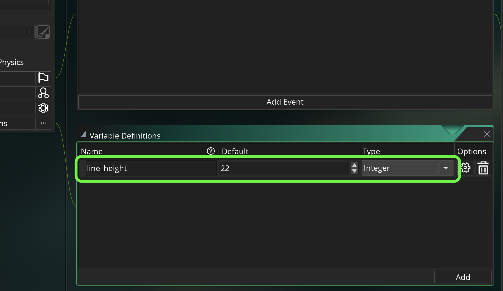
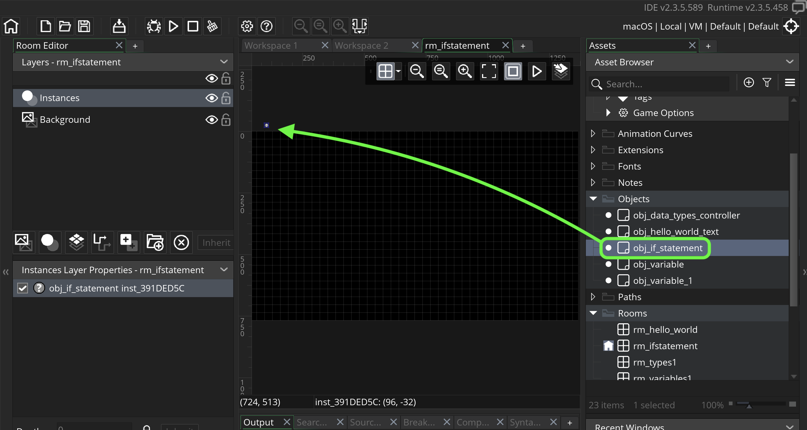

### GMS2 If Statements


This tutorial is intended for those wanting an introduction to <i>GameMaker Studio 2</i> using their scrpting language <i>GML</i>. This assumes no prior knowledge of the software or scripting. This walk through looks at [if statements](https://manual.yoyogames.com/GameMaker_Language/GML_Overview/Language_Features/If_Else_and_Conditional_Operators.htm) in GMS2. This is a fundamental feature of most programming languages and the `if` condition takes an expression (`if (<expression>)`) which will perform one more more *statements*.

In pseudo code this is what we are checking to see if the expression in between the parenthesis resolves to true or false.  If the if statement is true then it runs what is between the curly braces. An expression has to resolve to true or false (remember any real number over .5 resolves to true and all under it resolve to false).

```
if (<expression>)
{
    <statement>;
    <statement>;
}
```

* Tested on GameMake Studio2.3.5.589
* An existing [GML Project](https://github.com/maubanel/GMS2-Snippets/blob/main/rename-project/README.md#user-content-rename-gms2-project)

<br>

---

##### `Step 1.`\|`ITB`|:small_blue_diamond:

Create a new room by *left clicking* on **Rooms** arrow in the **Asset Browser** to open up the rooms list.  *Right click* and select **Rename** and call it `rm_ifstatement`. Go to **Room Order** and move it to the top of the list if you have other rooms in this project.


##### `Step 2.`\|`FHIU`|:small_blue_diamond: :small_blue_diamond: 

Right click on **Objects** in the **Asset Browser** and select **Create | Object**.  Call this object `obj_if_statement`.  


##### `Step 3.`\|`ITB`|:small_blue_diamond: :small_blue_diamond: :small_blue_diamond:

Add a **Variable Definition | Variable** of type **integer** (an integer is a whole number, non-fractional) called `line_height` set to a **Default** of `22`.
 



##### `Step 4.`\|`ITB`|:small_blue_diamond: :small_blue_diamond: :small_blue_diamond: :small_blue_diamond:

Press the **Events | Add Events | Draw | Draw** to add a draw event.  So we will now add a script including a condition statement.  As an **expression** we will just use `true` (1).  `True` always resolves to **true**.  We use *curly braces* as we might want to do multiple things based on that `if` statement.  It will run all lines in-between the curly braces. 

We will also align text to center then reset the alignment.

```
//Show result of if statement on sixth line<br>
if (true)
{
    draw_text(room_width * .5, line_height * 6, "The if statement is true" );
}
```


##### `Step 5.`\|`ITB`| :small_orange_diamond:

Now drag an instance of **obj_if_statement** into the room **rm_ifstatement**




##### `Step 6.`\|`ITB`| :small_orange_diamond: :small_blue_diamond:

Now *press* the <kbd>Play</kbd> button in the top menu bar to launch the game. Notice that it prints the message as the if statement resolved to true.


##### `Step 7.`\|`ITB`| :small_orange_diamond: :small_blue_diamond: :small_blue_diamond:

Now what happens if it resolves to `false`?  What if we wanted to do something when the statement resolved to `false`?  We can follow the `if` statement with an `else` statement.  This will only run if the if statement resolves to `false`. 
    
Note: Please be aware that you cannot put anything (except for a comment) between the last bracket from the if statement and the else.  It will not compile.

```
if (expression)
{ 
    //do something...<br>
}	
else
{
    //do something else...<br>
}
```

So lets add a different sentence for an else condition:

```
else
{
    draw_text(room_width * .5, line_height * 6, "The if statement is false" );
}
```


##### `Step 8.`\|`ITB`| :small_orange_diamond: :small_blue_diamond: :small_blue_diamond: :small_blue_diamond:

Now *press* the <kbd>Play</kbd> button in the top menu bar to launch the game. Notice that it prints the same true message and not the false one.


##### `Step 9.`\|`ITB`| :small_orange_diamond: :small_blue_diamond: :small_blue_diamond: :small_blue_diamond: :small_blue_diamond:


##### `Step 10.`\|`ITB`| :large_blue_diamond:


##### `Step 11.`\|`ITB`| :large_blue_diamond: :small_blue_diamond: 


##### `Step 12.`\|`ITB`| :large_blue_diamond: :small_blue_diamond: :small_blue_diamond: 


##### `Step 13.`\|`ITB`| :large_blue_diamond: :small_blue_diamond: :small_blue_diamond:  :small_blue_diamond: 


##### `Step 14.`\|`ITB`| :large_blue_diamond: :small_blue_diamond: :small_blue_diamond: :small_blue_diamond:  :small_blue_diamond: 


##### `Step 15.`\|`ITB`| :large_blue_diamond: :small_orange_diamond: 


##### `Step 16.`\|`ITB`| :large_blue_diamond: :small_orange_diamond:   :small_blue_diamond: 


##### `Step 17.`\|`ITB`| :large_blue_diamond: :small_orange_diamond: :small_blue_diamond: :small_blue_diamond:


##### `Step 18.`\|`ITB`| :large_blue_diamond: :small_orange_diamond: :small_blue_diamond: :small_blue_diamond: :small_blue_diamond:


##### `Step 19.`\|`ITB`| :large_blue_diamond: :small_orange_diamond: :small_blue_diamond: :small_blue_diamond: :small_blue_diamond: :small_blue_diamond:


##### `Step 20.`\|`ITB`| :large_blue_diamond: :large_blue_diamond:


##### `Step 21.`\|`ITB`| :large_blue_diamond: :large_blue_diamond: :small_blue_diamond:


| `gms2.variables`\|`THE END`| 
| :--- |
| **That's All Folks!** That's it for variables. |

___


