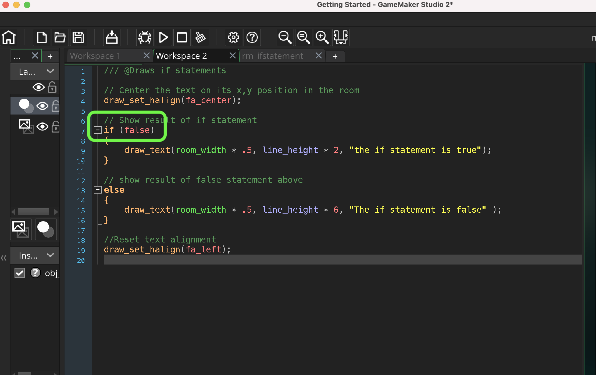

### GMS2 If Statements


This tutorial is intended for those wanting an introduction to <i>GameMaker Studio 2</i> using their scrpting language <i>GML</i>. This assumes no prior knowledge of the software or scripting. This walk through looks at [if statements](https://manual.yoyogames.com/GameMaker_Language/GML_Overview/Language_Features/If_Else_and_Conditional_Operators.htm) in GMS2. This is a fundamental feature of most programming languages and the `if` condition takes an expression (`if (<expression>)`) which will perform one more more *statements*.

In pseudo code this is what we are checking to see if the expression in between the parenthesis resolves to true or false.  If the if statement is true then it runs what is between the curly braces. An expression has to resolve to true or false (remember any real number over .5 resolves to true and all under it resolve to false).

```
if (<expression>)
{
    <statement>;
    <statement>;
}
```

* Tested on GameMake Studio2.3.5.589
* An existing [GML Project](https://github.com/maubanel/GMS2-Snippets/blob/main/rename-project/README.md#user-content-rename-gms2-project)

<br>

---

##### `Step 1.`\|`ITB`|:small_blue_diamond:

Create a new room by *left clicking* on **Rooms** arrow in the **Asset Browser** to open up the rooms list.  *Right click* and select **Rename** and call it `rm_ifstatement`. Go to **Room Order** and move it to the top of the list if you have other rooms in this project.


##### `Step 2.`\|`FHIU`|:small_blue_diamond: :small_blue_diamond: 

Right click on **Objects** in the **Asset Browser** and select **Create | Object**.  Call this object `obj_if_statement`.  


##### `Step 3.`\|`ITB`|:small_blue_diamond: :small_blue_diamond: :small_blue_diamond:

Add a **Variable Definition | Variable** of type **integer** (an integer is a whole number, non-fractional) called `line_height` set to a **Default** of `22`.
 


##### `Step 4.`\|`ITB`|:small_blue_diamond: :small_blue_diamond: :small_blue_diamond: :small_blue_diamond:

Press the **Events | Add Events | Draw | Draw** to add a draw event.  So we will now add a script including a condition statement.  As an **expression** we will just use `true` (1).  `True` always resolves to **true**.  We use *curly braces* as we might want to do multiple things based on that `if` statement.  It will run all lines in-between the curly braces. 

We will also align text to center then reset the alignment.

```
//Show result of if statement on sixth line<br>
if (true)
{
    draw_text(room_width * .5, line_height * 6, "The if statement is true" );
}
```


##### `Step 5.`\|`ITB`| :small_orange_diamond:

Now drag an instance of **obj_if_statement** into the room **rm_ifstatement**


##### `Step 6.`\|`ITB`| :small_orange_diamond: :small_blue_diamond:

Now *press* the <kbd>Play</kbd> button in the top menu bar to launch the game. Notice that it prints the message as the if statement resolved to true.


##### `Step 7.`\|`ITB`| :small_orange_diamond: :small_blue_diamond: :small_blue_diamond:

Now what happens if it resolves to `false`?  What if we wanted to do something when the statement resolved to `false`?  We can follow the `if` statement with an `else` statement.  This will only run if the if statement resolves to `false`. 
    
Note: Please be aware that you cannot put anything (except for a comment) between the last bracket from the if statement and the else.  It will not compile.

```
if (expression)
{ 
    //do something...<br>
}	
else
{
    //do something else...<br>
}
```

So lets add a different sentence for an else condition:

```
else
{
    draw_text(room_width * .5, line_height * 6, "The if statement is false" );
}
```


##### `Step 8.`\|`ITB`| :small_orange_diamond: :small_blue_diamond: :small_blue_diamond: :small_blue_diamond:

Now *press* the <kbd>Play</kbd> button in the top menu bar to launch the game. Notice that it prints the same true message and not the false one.


##### `Step 9.`\|`ITB`| :small_orange_diamond: :small_blue_diamond: :small_blue_diamond: :small_blue_diamond: :small_blue_diamond:

To see the false message you need to change the expression in parenthesis after the if statement to false.




##### `Step 10.`\|`ITB`| :large_blue_diamond:

Now *press* the <kbd>Play</kbd> button in the top menu bar to launch the game. Now the true message no longer displays but is replaced by the false one.


##### `Step 11.`\|`ITB`| :large_blue_diamond: :small_blue_diamond: 

Lets look at a more practical expression.  We will use a comparison operator. This compares two values and returns a true or false.  The most common are:

`==` (equals): *checks if value on both sides of the operand are the same*

`!=` (not equals): *checks if value on both sides of the operand are different*

`>` (greater than): *checks if value on the right hand operand is greater than the left had side*

`<` (less than): *checks if value on the right hand operand is less than the left had side*

`>=` (greater than or equal): *checks if value on the right hand operand is greater than or equal to the left had side*

`<=` (less than or equal): *checks if value on the right hand operand is less than or equal the left had side*.

First lets add an age variable so we have something to compare.  Open up **obj_if_statement** and press **Variable Definition**.  Press the <kbd>Add</kbd> button and call the new variable `age` with a **Type** of `integer` and **Default** of any age you like, I picked `44`.


##### `Step 12.`\|`ITB`| :large_blue_diamond: :small_blue_diamond: :small_blue_diamond: 

Lets add a second line that checks to see if the person with the age is an adult or not.  We will use `age >= 18` to do this.
		
Note: >= 18 is functionally the same as > 17.  The choice is up to you, whatever more clearly expresses your objective.  I assume that to prove you are an adult you are looking for being 18 or over not greater than 17.


##### `Step 13.`\|`ITB`| :large_blue_diamond: :small_blue_diamond: :small_blue_diamond:  :small_blue_diamond: 

Now *press* the <kbd>Play</kbd> button in the top menu bar to launch the game. Since I have age above 18, I get the adult message as *44 is >= to 18*. Since 


##### `Step 14.`\|`ITB`| :large_blue_diamond: :small_blue_diamond: :small_blue_diamond: :small_blue_diamond:  :small_blue_diamond: 

Lets add a eigth line that checks the return value of a function.  Remember that functions can return a variable, some return booleans and are usually used inside if conditional statements.  One of these in GameMaker is **[keyboard_check(key)](https://manual.yoyogames.com/index.htm#t=GameMaker_Language%2FGML_Reference%2FGame_Input%2FKeyboard_Input%2Fkeyboard_check.htm)**. You do not know what the return value of the function without looking in the manual.  This can be done by typing the function name into the help index tab or clicking the above link.  Look at the return value.

Note: If you see **NA** this means the function returns no value, and is definitely not usable insinde an if statement.


##### `Step 15.`\|`ITB`| :large_blue_diamond: :small_orange_diamond: 

The manual also tells you about what arguments you need to pass to the function.  In this case it is an enumerator of the key you want to check.  If our case we will want to check the space key: `vk_space`.  This *function* will return `true` every time the <kbd>space</kbd> button is held down and false if it is not.


##### `Step 16.`\|`ITB`| :large_blue_diamond: :small_orange_diamond:   :small_blue_diamond: 

Now *press* the <kbd>Play</kbd> button in the top menu bar to launch the game. *Press* the <kbd>space bar</kbd> and let go.  The message should change accordingly.


##### `Step 17.`\|`ITB`| :large_blue_diamond: :small_orange_diamond:   :small_blue_diamond: :small_blue_diamond:

Select the **File | Save Project** then press **File | Quit** to make sure everything in the game is saved. If you are using **GitHub** open up **GitHub Desktop** and add a title and longer description (if necessary) and press the <kbd>Commit to main</kbd> button. Finish by pressing **Push origin** to update the server with the latest changes.


| `gms2.variables`\|`THE END`| 
| :--- |
| **That's All Folks!** That's it for if statements for now. |

___


